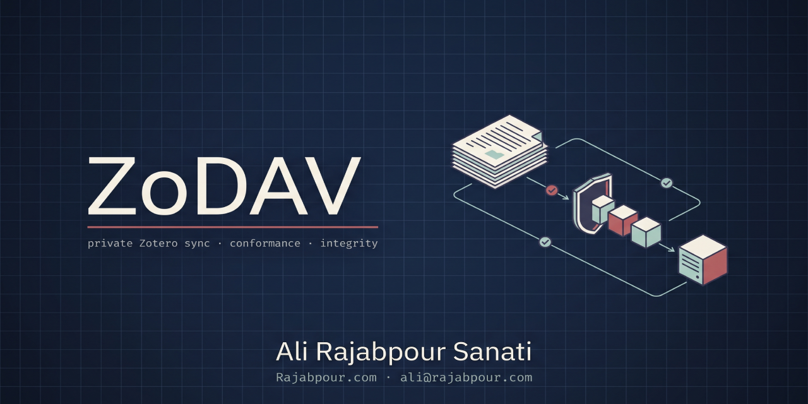

<div align="center">



# ZoDAV

**Private Zotero WebDAV sync, plus a conformance and integrity checker for any Zotero WebDAV server.**

<p>
  <a href="https://github.com/ali-rajabpour/ZoDAV/actions/workflows/ci.yml"></a>
  <a href="https://github.com/ali-rajabpour/ZoDAV/actions/workflows/codeql.yml"></a>
  <a href="https://scorecard.dev/viewer/?uri=github.com/ali-rajabpour/ZoDAV"></a>
</p>
<p>
  <a href="https://github.com/ali-rajabpour/ZoDAV/releases/latest"></a>
  <a href="https://github.com/ali-rajabpour/ZoDAV/blob/main/LICENSE"></a>
  <a href="#zodav-audit-for-any-server"></a>
  <a href="#quick-start"></a>
  <a href="#6-connect-zotero"></a>
  <a href="https://github.com/ali-rajabpour/ZoDAV/commits/main"></a>
  <a href="https://github.com/ali-rajabpour/ZoDAV/stargazers"></a>
</p>

[Quick start](#quick-start) · [zodav-audit](#zodav-audit-for-any-server) · [Compatibility](#compatibility) · [Troubleshooting](#troubleshooting) · [Changelog](CHANGELOG.md) · [Security](SECURITY.md) · [Contributing](CONTRIBUTING.md)

</div>

**ZoDAV is Zotero WebDAV: a private file-sync server for Zotero that is never on the public internet.**

ZoDAV stores your Zotero attachment files (PDFs, snapshots, notes) on a server you control. The server is reachable only over a private [Tailscale](https://tailscale.com) network (or your own [Headscale](https://headscale.net)). It has no public address and no open port. It replaces paid Zotero Storage for a personal library, and it is started with one `.env` file and one command.

This repository also contains **`zodav-audit`**, a checker that works against **any** Zotero WebDAV server (ZoDAV, Nextcloud, Synology, Koofr, pCloud, nginx, Caddy, rclone and others). Other projects will give you a WebDAV server. None of them check the things Zotero depends on. `zodav-audit` does:

- **Conformance:** does the server behave the way Zotero's client needs? If not, which Zotero error will you see, and why?
- **Integrity:** is every `.zip` / `.prop` pair in the store consistent and readable?
- **Repair:** fix what can be fixed safely, with a dry run by default and a quarantine for anything removed.

Zotero forum users who hit sync problems are usually told to "Reset File Sync History". `zodav-audit` tells you what is actually wrong.

## Table of contents

- [Features](#features)
- [How it works](#how-it-works)
- [Requirements](#requirements)
- [Quick start](#quick-start)
- [Switching from Zotero Storage or another WebDAV server](#switching-from-zotero-storage-or-another-webdav-server)
- [Using Headscale instead of Tailscale](#using-headscale-instead-of-tailscale)
- [Deploying with Dokploy, Portainer or Coolify](#deploying-with-dokploy-portainer-or-coolify)
  - [Checks and audits without the zodav script](#checks-and-audits-without-the-zodav-script)
- [Confirming that files are synced](#confirming-that-files-are-synced)
- [Letting other containers write files](#letting-other-containers-write-files)
- [Backups](#backups)
- [Monitoring and alerts](#monitoring-and-alerts)
- [Command reference: ./zodav](#command-reference-zodav)
- [Configuration reference](#configuration-reference)
- [zodav-audit for any server](#zodav-audit-for-any-server)
- [Finding reference](#finding-reference)
- [Compatibility](#compatibility)
- [Troubleshooting](#troubleshooting)
- [Updating](#updating)
- [Uninstalling](#uninstalling)
- [Security](#security)
- [Development and tests](#development-and-tests)
- [To-do](#to-do)
- [Contributing](#contributing)
- [Citing ZoDAV](#citing-zodav)
- [Contributors](#contributors)
- [Star history](#star-history)
- [License](#license)
- [Author](#author)
- [Acknowledgements](#acknowledgements)

## Features

Server:

- Private by design: no published ports, no reverse proxy, no public DNS name. Only your own devices on your tailnet can connect.
- Password login (HTTP Basic, passwords hashed with bcrypt), a generated 32-character password, an optional second user for automation.
- Apache httpd with `mod_dav`. Only the methods Zotero uses are allowed (`OPTIONS`, `PROPFIND`, `GET`, `HEAD`, `PUT`, `DELETE`, `MKCOL`).
- Hardened containers: non-root where the image allows, read-only root filesystems, all Linux capabilities dropped, no privilege escalation, images pinned by digest.
- Daily self-check of every stored file, with alerts to Telegram, email, ntfy, Slack, Discord or any webhook.
- Alarms for mass deletion, an idle store, low disk space and stale or missing backups.
- Optional encrypted, off-host backups with restic, pruned automatically and verified weekly. A one-command restore drill proves the backup works.
- One control script, `./zodav`, for everything.

Audit tool (`zodav-audit`):

- One Python file, standard library only, Python 3.10+.
- Runs the exact steps of Zotero's "Verify Server", plus the checks Verify skips: authentication challenge, `getlastmodified` in listings, a byte-exact `.zip` / `.prop` round trip, real 404s for missing files, and redirects.
- Maps every failure to the Zotero error you would see, the likely cause and a fix. Adds URL hints for Nextcloud, Synology, Koofr, pCloud, Jianguoyun, 4shared and Box.
- Integrity checks on a URL or a local folder. Repair with dry run, read-back verification and quarantine.
- Text, JSON (`--json`) and a single self-contained HTML report (`--html`) you can attach to a forum post.

## How it works

```
Zotero Desktop ──tailnet tcp/80──▶ [tailscale] ──bridge──▶ [webdav :8080] ── volume zodav-data
other containers on the host ──docker network "zodav"──▶ [webdav :8080]
                                [audit]  ── zodav-audit loop (read-only data mount) ──▶ alerts (webhook/Telegram/email)
                                [backup] ── restic → off-host repository (read-only data mount, optional)
```

Everything is defined in one `compose.yaml`. There are four containers:

| Container | What it does |
|---|---|
| `webdav` | Apache httpd 2.4 with `mod_dav` and `mod_dav_fs`. `/zotero/` is the only WebDAV location and needs a login. `/healthz` is the only page without a login. Everything else is denied. Runs as `www-data` on a read-only root filesystem. Passwords are hashed with bcrypt into a memory-only (tmpfs) file when the container starts. |
| `tailscale` | A Tailscale client sidecar in userspace mode. It is only a node that joins your existing tailnet or Headscale server; ZoDAV runs no coordination server, relay or exit node (no `NET_ADMIN`, no `/dev/net/tun`). It forwards tailnet TCP port 80 to `webdav:8080`. It uses Headscale when `ZODAV_HEADSCALE_URL` is set. |
| `audit` | Runs `zodav-audit watch` every 24 hours (by default) on the data volume, mounted read-only. Writes `latest.json` and `latest.html` reports, prints one summary line per run, and sends alerts. |
| `backup` | Optional. Runs restic every 24 hours against an off-host repository, with the data volume mounted read-only. Turned on by `COMPOSE_PROFILES=backup`. |

Your files live in the Docker named volume `zodav-data`, under `zotero/`. Each attachment is stored the way Zotero stores it: `KEY.zip` (the file) and `KEY.prop` (its modification time and MD5 checksum).

## Requirements

- A Linux server, or any always-on computer, that can run Docker. It does not need a public IP address.
- Docker Engine with Compose v2 (`docker compose`).
- A free [Tailscale](https://tailscale.com) account, or your own Headscale server.
- Zotero 7 or newer on your computer, and Tailscale installed on that computer too.
- Disk space at least as large as your attachment library, plus room to grow. Attachment files are stored as ZIP files.

ZoDAV serves one personal library. Group library files cannot use WebDAV in Zotero, so ZoDAV cannot store them.

## Quick start

These steps are for Tailscale. For Headscale see [Using Headscale instead of Tailscale](#using-headscale-instead-of-tailscale).

### 1. Create a Tailscale account

Sign up at <https://login.tailscale.com/start>. Free personal plans are enough.

### 2. Add the tag and the access rule

ZoDAV joins your network with a tag (`tag:zodav`), so you can control exactly who may reach it. In the admin console open **Access controls** (<https://login.tailscale.com/admin/acls>) and add the two blocks below to the policy file. If the file already has `tagOwners` or `grants`, add the new entries to the existing ones.

```json
{
  "tagOwners": {
    "tag:zodav": ["autogroup:admin"]
  },
  "grants": [
    {
      "src": ["autogroup:member"],
      "dst": ["tag:zodav"],
      "ip":  ["tcp:80"]
    }
  ]
}
```

This lets every device that belongs to a user of your tailnet connect to ZoDAV on port 80, and nothing else. ZoDAV itself cannot start connections to your other devices. If your policy still contains the default "allow all" grant, the rule above does not narrow anything: remove the allow-all grant if you want ZoDAV limited to the rule.

### 3. Create an auth key

In the admin console go to **Settings > Keys** (<https://login.tailscale.com/admin/settings/keys>) and choose **Generate auth key**:

- **Tags:** select `tag:zodav`. The key must be tagged, because ZoDAV asks for that tag when it joins.
- **Reusable:** leave it off. A one-off key is enough, because ZoDAV remembers its login in a Docker volume. Turn it on only if you expect to recreate the server several times.
- **Ephemeral:** leave it off.

Copy the key (it looks like `tskey-auth-xxxxx`). It is shown once.

After ZoDAV first appears under **Machines** in the admin console (step 4), revoke or expire this key there. It is only used for the first login: ZoDAV stores its login in a Docker volume and does not use the key again.

### 4. Prepare the server

Install Docker Engine and the Compose plugin by following the official guide: <https://docs.docker.com/engine/install/>. Then:

```bash
git clone https://github.com/ali-rajabpour/ZoDAV.git
cd ZoDAV
./zodav setup
```

`./zodav setup` asks a few questions:

1. the auth key from step 3 (required),
2. a Headscale URL (press Enter to skip),
3. an alert webhook URL (press Enter to skip; Telegram and email are set in `.env`, see [Monitoring and alerts](#monitoring-and-alerts)),
4. a backup repository (press Enter to skip, see [Backups](#backups)).

It writes a `.env` file readable only by you, with a generated password. It will not overwrite an existing `.env`.

Start ZoDAV:

```bash
./zodav start
```

The first start builds the images and takes a few minutes. When it finishes it prints the values to use in Zotero. To see them again later:

```bash
./zodav settings
./zodav settings --show-password
```

### 5. Put the server's address on your computer

The computer that runs Zotero must be on the same tailnet. Install Tailscale on it (<https://tailscale.com/download>) and log in with the same account. The address printed by ZoDAV looks like `zodav.your-tailnet.ts.net`. It only resolves while your computer is connected to Tailscale.

### 6. Connect Zotero

In Zotero 7 or newer:

1. Open **Settings > Sync > File Syncing**.
2. Under "Sync attachment files in My Library using", choose **WebDAV**.
3. Protocol: **http**.
4. URL: the address from `./zodav settings`, for example `zodav.your-tailnet.ts.net`. Do not add `http://`, a port or `/zotero`. Zotero adds the `zotero/` folder itself.
5. Username: the one from `./zodav settings` (default `zotero`).
6. Password: the one from `./zodav settings --show-password`.
7. Click **Verify Server**. If Zotero asks to create the `zotero` folder, accept.
8. Sync.

Why plain `http` is fine here: the traffic never crosses the internet unprotected. Tailscale (WireGuard) encrypts it from your computer to the server, end to end, inside the tailnet. A public HTTPS certificate would add nothing. Mobile apps are a different case, see the [To-do](#to-do).

If Verify Server fails, see [Troubleshooting](#troubleshooting). To test the server from the outside, run `./zodav check`.

## Switching from Zotero Storage or another WebDAV server

Changing the file-sync method in Zotero does not move your files. ZoDAV starts empty.

1. Keep your local attachment files. Do not delete anything on the old service yet.
2. Pick the computer that has all your attachment files. Set up WebDAV as in the quick start.
3. Sync. Zotero uploads the files it has to the new server.
4. If attachments on this computer are not uploaded, use **Settings > Sync > Reset > Reset File Sync History**. This is a heavy action: Zotero forgets what it believes is on the server and checks every file again. Do it on one computer only, and read what Zotero says in the confirmation.
5. On your other computers, set up the same WebDAV settings and sync. Check that the files download and open.
6. Run `./zodav check`. When everything is clean and verified on every computer, then (and only then) remove files from the old service.

Zotero Storage is separate from WebDAV and is not read by ZoDAV. Group library files stay in Zotero Storage.

## Using Headscale instead of Tailscale

If you run your own [Headscale](https://headscale.net) server, ZoDAV joins it as one more node. ZoDAV never runs a control server itself: its `tailscale` container is a client sidecar that logs in to your Headscale with a tagged pre-auth key and forwards mesh port 80 to the WebDAV container. The steps below assume Headscale 0.29 or newer with a `grants` policy.

1. **Allow the tag in your policy.** Add one entry to `tagOwners` and one grant. An empty owner list means no user can put the tag on a device themselves; only the administrator applies it, through a tagged key:

   ```json
   {
     "tagOwners": {
       "tag:zodav": []
     },
     "grants": [
       {"src": ["you@"], "dst": ["tag:zodav"], "ip": ["tcp:80"]}
     ]
   }
   ```

   Replace `you@` with your Headscale user (or a group). Default is deny, so this is the only traffic allowed to ZoDAV, and ZoDAV cannot open connections to your devices. Validate with `headscale policy check` and load the policy the way your server does.

2. **Create a single-use tagged key** on the Headscale server:

   ```bash
   headscale preauthkeys create --tags tag:zodav --expiration 1h
   ```

   On Headscale 0.29 a tagged key needs no `--user`; tagged nodes belong to no user and never expire. Older versions may need `--user`; see `headscale preauthkeys create --help`.

3. **Set two variables** in `.env` (or your hosting panel), then start ZoDAV within the key's lifetime:

   ```bash
   ZODAV_HEADSCALE_URL=https://headscale.example.com
   TS_AUTHKEY=hskey-auth-xxxxx
   ```

   With Headscale, `ZODAV_TS_TAG` is ignored: ZoDAV does not advertise tags itself (with an empty `tagOwners` that would be refused), the tag comes from the key.

4. **After the first start**, `headscale nodes list` shows `zodav` with `tag:zodav`. The login is stored in the `tailscale-state` volume, so you can clear `TS_AUTHKEY`. Only if you delete that volume does ZoDAV need a new key.

5. **Connect Zotero** using the MagicDNS name, `zodav.<your MagicDNS base domain>` (for example `zodav.mesh.internal`), with protocol `http`. MagicDNS must be on in Headscale and accepted on your computer. `./zodav settings` prints the exact name.

## Deploying with Dokploy, Portainer or Coolify

`compose.yaml` works unchanged as a compose application.

1. Create a new compose application from this Git repository (or paste `compose.yaml` and keep the `webdav/`, `audit/` and `backup/` folders next to it, because the images are built from them).
2. The compose file path is `compose.yaml`.
3. In the platform's environment form, paste the variables from `.env.example`. At minimum set `ZODAV_PASSWORD`, and `TS_AUTHKEY` for the first start (it can be cleared once ZoDAV has joined your network). Replace every `CHANGE_ME` value.
4. Do not add ports, domains, labels or a reverse proxy. ZoDAV is reached over the tailnet only.
5. Deploy. Read the machine name in the Tailscale admin console (or in the `tailscale` container logs) and use it as the Zotero URL, with protocol `http`.

The panel writes your settings, passwords included, to a `.env` file next to the compose file, readable by every account on the host (mode 644), and rewrites it on each deploy. Lock down the application's folder once, on the host, as root. The panel runs as root, so deploys keep working, and the setting survives redeploys because only the `code` folder inside it is recreated. For Dokploy:

```sh
chmod 700 /etc/dokploy/compose/<app-name>
```

The `./zodav` script is optional on these platforms. Everything it does can be done from the panel, as described next.

### Checks and audits without the zodav script

**Automatic.** The `audit` container checks every stored file once a day (interval: `ZODAV_AUDIT_INTERVAL_HOURS`) and sends alerts to the channels you configured. In the panel, open the `audit` service logs: each run prints one line such as `zodav-audit watch: 152 attachments, 0 error(s), 0 warning(s) - OK`. To prove alerts arrive, set `ZODAV_IDLE_DAYS=0` and redeploy: every run then raises the idle warning. Set it back afterwards.

**On demand, in the panel's terminal.** Open a terminal (Dokploy: service, then Terminal) in the `audit` container. The password is already in its environment, so no flags are needed:

```sh
# Is the server Zotero-compatible? Writes only Zotero's own test file and deletes it.
python /app/zodav_audit.py conformance http://webdav:8080/

# Check every stored attachment now.
python /app/zodav_audit.py integrity /data/zotero

# Show what repair would do. Changes nothing.
python /app/zodav_audit.py repair http://webdav:8080/
```

In a terminal in the `backup` container (only when backups are enabled):

```sh
restic snapshots                    # list of backups, newest last
restic ls latest | grep ABCD1234    # is attachment ABCD1234 in the latest backup?
restic check                        # consistency of the backup repository
```

**From your computer, over the tailnet.** This tests exactly the path Zotero uses and writes HTML reports you can open:

```sh
export ZODAV_AUDIT_PASSWORD='your ZODAV_PASSWORD'
uvx --from git+https://github.com/ali-rajabpour/ZoDAV zodav-audit \
  conformance http://zodav.your-tailnet.ts.net/ --html conformance.html
uvx --from git+https://github.com/ali-rajabpour/ZoDAV zodav-audit \
  integrity http://zodav.your-tailnet.ts.net/ --html integrity.html
```

**Restore drill.** It needs Docker on the host, so run it over SSH in the folder where the platform checked out this repository. Platforms name the compose project after the application, so pass that name (it is the prefix of the container names in `docker ps`), and make sure the same variables are available (most platforms write them to `.env` in that folder):

```sh
COMPOSE_PROJECT_NAME=<application-name> sh backup/restore-drill.sh compose.yaml
```

Run it about once a month. It prints `restore drill ok` when the latest backup restores and checks clean.

## Confirming that files are synced

1. **Zotero shows no error.** The sync button (top right) has no red error mark. Hover over it to see file progress.
2. **The file is on the server.** In Zotero, right-click a PDF and choose **Show File**. The name of the folder that holds it is the attachment key, for example `ABCD1234`. Then, from a device on the tailnet:

   ```sh
   curl -u zotero -I http://zodav.your-tailnet.ts.net/zotero/ABCD1234.zip
   curl -u zotero -I http://zodav.your-tailnet.ts.net/zotero/ABCD1234.prop
   ```

   `HTTP/1.1 200 OK` for both means the file is stored. `404` means it has not been uploaded yet.
3. **Counts grow.** The `attachments` number in the audit log line and report grows as you add files. It counts stored files only, not links or notes.
4. **Download it back (the definitive test).** Either open the PDF on a second computer that uses the same Zotero account, the same WebDAV settings and is on the tailnet, or on the same computer: add a test item with a PDF, sync, delete only the file inside `~/Zotero/storage/<KEY>/` in your file manager (not the item in Zotero), then double-click the item. Zotero downloads it again from ZoDAV.
5. **The backup holds it.** After the next nightly backup, `restic ls latest | grep <KEY>` in the `backup` container shows the file.

## Letting other containers write files

Other containers on the same server can read and write the store without going through Tailscale. The `webdav` container is on a Docker network named `zodav`.

1. Give the automation its own login in `.env` (this is the optional second user):

   ```bash
   ZODAV_SERVICE_USERNAME=paperbot
   ZODAV_SERVICE_PASSWORD=at-least-24-letters-digits-dash-underscore
   ```

   The service password must also be at least 24 characters of `A-Z a-z 0-9 _ -`, and the name must differ from `ZODAV_USERNAME`. Restart with `./zodav start` to apply it.
2. In the other application's compose file, join the existing network:

   ```yaml
   services:
     myapp:
       image: example/myapp
       networks: [zodav]

   networks:
     zodav:
       external: true
   ```

3. Use `http://webdav:8080/zotero/` as the WebDAV address, with the service user name and password.

Separate users mean you can rotate either password on its own, and the access log shows which user wrote what. The service user has the same read and write access as the main user. Files must follow Zotero's layout (`KEY.zip` and `KEY.prop`) to be used by Zotero, see [zodav-audit](#zodav-audit-for-any-server) to check them.

## Backups

### Why off-host

The data volume is on the same machine as the server. If the disk dies, the server is stolen or someone deletes the files, the volume goes with it. A sync service is not a backup: Zotero treats a deleted attachment as deleted everywhere. Backups must go to a different place.

ZoDAV uses [restic](https://restic.net): encrypted, deduplicated, with many storage back ends.

### Choose a repository

Pick one place to send backups to and set `RESTIC_REPOSITORY` plus the credentials that place needs. Examples:

Amazon S3 or an S3-compatible service:

```bash
RESTIC_REPOSITORY=s3:s3.amazonaws.com/your-bucket
AWS_ACCESS_KEY_ID=xxxxx
AWS_SECRET_ACCESS_KEY=xxxxx
AWS_DEFAULT_REGION=eu-west-1
```

Backblaze B2:

```bash
RESTIC_REPOSITORY=b2:your-bucket:zodav
B2_ACCOUNT_ID=xxxxx
B2_ACCOUNT_KEY=xxxxx
```

restic REST server:

```bash
RESTIC_REPOSITORY=rest:https://backup.example.com/zodav
RESTIC_REST_USERNAME=xxxxx
RESTIC_REST_PASSWORD=xxxxx
```

SFTP: the compose file does not pass SSH keys or a known-hosts file into the backup container, so `sftp:` repositories do not work with the provided `compose.yaml`. Use one of the repository types above. Azure Blob Storage (`azure:`) is also wired up, see `.env.example`.

The backup container refuses a `RESTIC_PASSWORD` shorter than 24 characters or still starting with `CHANGE_ME`, and it skips a run (without counting it as a success) while the store holds no attachments, so an empty store never replaces good snapshots.

### Turn backups on

Easiest: answer the backup question in `./zodav setup`. It sets `COMPOSE_PROFILES=backup`, your repository, and a generated `RESTIC_PASSWORD`. Add the provider credentials to `.env` by hand.

By hand, add to `.env`:

```bash
COMPOSE_PROFILES=backup
RESTIC_PASSWORD=a-long-random-password
RESTIC_REPOSITORY=s3:s3.amazonaws.com/your-bucket
```

Then:

```bash
./zodav start
./zodav logs backup
```

You should see `backup ok`. The first run creates the repository.

**Save `RESTIC_PASSWORD` in a password manager now.** It encrypts the backups. If you lose it, the backups cannot be read by anyone, including you.

### Schedule and retention

- One backup every 24 hours.
- After each backup, old snapshots are removed: the last 7 daily, 4 weekly and 12 monthly are kept.
- Once a week, `restic check --read-data-subset=5%` re-reads a random 5 percent of the stored data to catch damage.
- On success the backup container writes a timestamp. If the last success is older than 26 hours, the container turns `unhealthy` and the audit sends an alert (`BACKUP_STALE`). If backups were never configured, the audit warns (`BACKUP_NEVER`).
- Failures are logged as `BACKUP FAILED: ...` and retried at the next interval.

### Restore drill

Prove that the backup can be restored, without touching your live data:

```bash
./zodav restore-drill
```

It restores the latest snapshot into a temporary Docker volume, runs the integrity check on it, prints `restore drill ok` or `restore drill FAILED: ...`, and removes the volume. Run it after setting up backups and from time to time after that.

### Full restore after losing the server

1. Install Docker and clone this repository on the new server.
2. Create `.env` with `./zodav setup`, then edit it. Use the **same** `RESTIC_REPOSITORY`, provider credentials and `RESTIC_PASSWORD` as before. A new `ZODAV_PASSWORD` is fine, but you will have to enter it in Zotero again. `COMPOSE_PROFILES=backup` must be set.
3. Start once so that the data volume exists, then stop the services that use it:

   ```bash
   ./zodav start
   docker compose stop webdav audit
   ```

4. Restore the latest snapshot into a scratch volume:

   ```bash
   docker volume create zodav-restore
   docker run --rm -v zodav-restore:/restore alpine chown 65534:65534 /restore
   docker compose run --rm --no-deps -T -v zodav-restore:/restore \
     --entrypoint restic backup restore latest --host zodav --target /restore
   ```

5. Copy the files into the live data volume and fix the owner (the web server runs as user 33):

   ```bash
   docker run --rm -v zodav-restore:/from:ro -v zodav_zodav-data:/to alpine \
     sh -c 'cp -a /from/data/zotero/. /to/zotero/ && chown -R 33:33 /to'
   ```

6. Start everything again and check:

   ```bash
   docker compose start webdav audit
   ./zodav check
   docker volume rm zodav-restore
   ```

7. If the new server has a new Tailscale name, update the URL in Zotero (`./zodav settings`).

Run the [restore drill](#restore-drill) first so you know the repository and password are good before you need them.

## Monitoring and alerts

The `audit` container runs `zodav-audit watch` on the data volume. By default it runs right after start and then every 24 hours (`ZODAV_AUDIT_INTERVAL_HOURS`). Each run does all integrity checks and these extra checks:

| Check | Raises | When | Default |
|---|---|---|---|
| Mass deletion | error `MASS_DELETION` | The number of attachments fell by more than `ZODAV_DELETE_ALERT_PERCENT` percent and by at least 5 since the previous run. | 10 percent |
| Idle store | warning `STORE_IDLE` | The newest `.prop` is older than `ZODAV_IDLE_DAYS` days: no device has uploaded anything. | 30 days |
| Free space | error `LOW_DISK` | Free space on the data volume is below `ZODAV_MIN_FREE_GB` GB, or below 5 percent. | 2 GB |
| Backup age | error `BACKUP_STALE` / warning `BACKUP_NEVER` | The last successful backup is older than 26 hours, or there has never been one. | fixed |

If there is any error or warning and at least one alert channel is set, one message is sent to every configured channel. A channel that fails is logged (reason only, no secrets) and the others still get the message. When the next run is clean after a failing one, a single "ZoDAV recovered" message is sent. If a run itself cannot complete, you get "ZoDAV audit could not run".

You can use any combination of the three channels. Set them in `.env`.

Webhook (`ZODAV_ALERT_URL`):

```bash
# ntfy: any plain URL gets the message as the body, with a Title header
ZODAV_ALERT_URL=https://ntfy.sh/your-secret-topic

# Slack incoming webhook (JSON {"text": ...})
ZODAV_ALERT_URL=https://hooks.slack.com/services/T000/B000/XXXX

# Discord webhook (JSON {"content": ...})
ZODAV_ALERT_URL=https://discord.com/api/webhooks/0000/XXXX
```

Slack and Discord are recognised by their host name. Any other URL receives a plain-text `POST`. Treat the URL as a secret: anyone who has it can post to it.

Telegram (set both or neither):

```bash
ZODAV_TELEGRAM_BOT_TOKEN=123456789:AAExampleTokenFromBotFather
ZODAV_TELEGRAM_CHAT_ID=123456789
```

Create the bot by chatting with `@BotFather` and sending `/newbot`. Then send your new bot any message, open `https://api.telegram.org/bot<TOKEN>/getUpdates` in a browser and read the number after `"chat":{"id":`. Messages are plain text, cut to Telegram's 4096-character limit.

Email (setting `ZODAV_SMTP_HOST` turns it on, `ZODAV_SMTP_FROM` and `ZODAV_SMTP_TO` are then required):

```bash
# Gmail or Fastmail: use an app password, not your normal password
ZODAV_SMTP_HOST=smtp.gmail.com
ZODAV_SMTP_PORT=587
ZODAV_SMTP_SECURITY=starttls
ZODAV_SMTP_USERNAME=you@example.com
ZODAV_SMTP_PASSWORD=your-app-password
ZODAV_SMTP_FROM=you@example.com
ZODAV_SMTP_TO=you@example.com,partner@example.com
```

The subject is `ZoDAV: <title>`. `ZODAV_SMTP_SECURITY` is `starttls` (default), `ssl` (usually port 465) or `none`; `none` sends unencrypted and logs a warning. Certificates are always verified. Username and password are set together or not at all. An incomplete setting (a token without a chat id, a host without `FROM` or `TO`) stops the audit with an error instead of silently sending nothing.

Reports: each run writes `latest.json` and `latest.html` into the `reports` volume and prints one line to the container log. Get the HTML report with:

```bash
./zodav report
```

It saves `zodav-report-<date>.html` in the current folder.

After a `MASS_DELETION` alert: open the report and check what disappeared. If files were removed by mistake, restore them from a backup (see [Backups](#backups)); the alert stays until the count recovers. If you deleted the files on purpose, run:

```bash
./zodav accept-deletions
```

This records today's attachment count as the new normal, so the next check does not alert about the same deletion.

## Command reference: ./zodav

Run `./zodav help` for this list. Docker must be running, except for `setup` and `help`.

| Command | What it does |
|---|---|
| `./zodav setup` | Asks for the auth key (required), a Headscale URL, an alert URL and a backup repository (all optional). Writes `.env` from `.env.example` with a generated 32-character `ZODAV_PASSWORD`, mode 600. If you give a backup repository it also sets `COMPOSE_PROFILES=backup` and generates `RESTIC_PASSWORD`. Refuses to overwrite an existing `.env`. |
| `./zodav start` | Builds and starts everything, waits until the WebDAV server and the audit container are healthy (not for the first backup), makes `.env` private if it was readable by others, then prints the Zotero settings. |
| `./zodav stop` | Runs `docker compose down`. Containers stop; your files and settings are kept. |
| `./zodav status` | Shows `docker compose ps`. |
| `./zodav settings [--show-password]` | Prints protocol, URL (the tailnet name of the server), username and, with the flag, the password. |
| `./zodav check` | Runs `zodav-audit conformance` against the server and `integrity` on all stored files, now. Exits 1 if either finds an error. |
| `./zodav report` | Copies the latest HTML audit report to `zodav-report-<date>.html` in the current folder. |
| `./zodav accept-deletions` | Tells the audit that the current number of attachments is the new normal. Use it after deleting files on purpose, see [Monitoring and alerts](#monitoring-and-alerts). |
| `./zodav repair [--apply]` | Runs `zodav-audit repair` on the store. Dry run without `--apply`. Quarantined files are written to `zodav-quarantine-<timestamp>/` in the current folder. |
| `./zodav restore-drill` | Restores the latest backup into a scratch volume and checks it. See [Backups](#backups). |
| `./zodav logs [service]` | Shows the last 100 log lines. Services: `webdav`, `tailscale`, `audit`, `backup`. |
| `./zodav help` | Shows the command list. |

## Configuration reference

All settings are environment variables, set in `.env` or in your hosting panel. `.env.example` documents each one.

| Name | Required | Default | Meaning |
|---|---|---|---|
| `ZODAV_PASSWORD` | yes | none | Password for the Zotero user. 24 to any length, only `A-Z a-z 0-9 _ -`. `./zodav setup` generates one. |
| `TS_AUTHKEY` | first start | none | Tailscale auth key (tagged `tag:zodav`) or tagged Headscale pre-auth key. Only used for the first login; may be cleared once ZoDAV has joined. |
| `ZODAV_HEADSCALE_URL` | no | empty | URL of your Headscale server. Empty means Tailscale. |
| `ZODAV_HOSTNAME` | no | `zodav` | Machine name on the tailnet. The address is `<name>.<your-tailnet>`. |
| `ZODAV_TS_TAG` | no | `tag:zodav` | Tag requested when joining Tailscale. Ignored with Headscale. |
| `ZODAV_USERNAME` | no | `zotero` | Zotero user name. Starts with a lowercase letter; `a-z 0-9 _ -`; up to 32 characters. |
| `ZODAV_SERVICE_USERNAME` | no | empty | Login for a second, automated user. Needs `ZODAV_SERVICE_PASSWORD`. Must differ from `ZODAV_USERNAME`. |
| `ZODAV_SERVICE_PASSWORD` | no | empty | Password for the service user. Same rules as `ZODAV_PASSWORD`. |
| `ZODAV_ALERT_URL` | no | empty | Webhook for alerts (ntfy, Slack, Discord, other). Empty means no webhook. |
| `ZODAV_TELEGRAM_BOT_TOKEN` | with Telegram | empty | Bot token from `@BotFather`. Needs `ZODAV_TELEGRAM_CHAT_ID`. |
| `ZODAV_TELEGRAM_CHAT_ID` | with Telegram | empty | Chat that receives alerts. Needs the bot token. |
| `ZODAV_SMTP_HOST` | with email | empty | SMTP server. Setting it turns email alerts on. |
| `ZODAV_SMTP_PORT` | no | `587` | SMTP port. |
| `ZODAV_SMTP_SECURITY` | no | `starttls` | `starttls`, `ssl` or `none` (unencrypted, logs a warning). |
| `ZODAV_SMTP_USERNAME` / `ZODAV_SMTP_PASSWORD` | no | empty | SMTP login. Set both or neither. Use an app password. |
| `ZODAV_SMTP_FROM` | with email | empty | Sender address. |
| `ZODAV_SMTP_TO` | with email | empty | Recipient address, or several separated by commas. |
| `ZODAV_AUDIT_INTERVAL_HOURS` | no | `24` | Hours between automatic checks. |
| `ZODAV_DELETE_ALERT_PERCENT` | no | `10` | Mass-deletion alert threshold, in percent of attachments. Also needs a drop of at least 5. |
| `ZODAV_IDLE_DAYS` | no | `30` | Warn if nothing was uploaded for this many days. |
| `ZODAV_MIN_FREE_GB` | no | `2` | Alert if free disk space is below this many GB (or 5 percent). |
| `COMPOSE_PROFILES` | no | empty | Set to `backup` to run the backup container. |
| `RESTIC_REPOSITORY` | with backups | empty | Where backups go. |
| `RESTIC_PASSWORD` | with backups | empty | Encrypts the backups. Keep a copy elsewhere. |
| `AWS_ACCESS_KEY_ID`, `AWS_SECRET_ACCESS_KEY`, `AWS_DEFAULT_REGION` | S3 | empty | S3 or S3-compatible credentials. |
| `B2_ACCOUNT_ID`, `B2_ACCOUNT_KEY` | Backblaze B2 | empty | B2 credentials. |
| `AZURE_ACCOUNT_NAME`, `AZURE_ACCOUNT_KEY` | Azure | empty | Azure Blob Storage credentials. |
| `RESTIC_REST_USERNAME`, `RESTIC_REST_PASSWORD` | REST server | empty | restic REST server login. |

The server refuses to start while a password still has its `CHANGE_ME` placeholder from `.env.example`, so a forgotten placeholder can never become a guessable password.

## zodav-audit for any server

`zodav-audit` is one Python file with no dependencies, Python 3.10 or newer. It works against any Zotero WebDAV server, not only ZoDAV.

### Run it

From a checkout:

```bash
python3 audit/zodav_audit.py --help
```

Without cloning, with [uv](https://docs.astral.sh/uv/):

```bash
uvx --from git+https://github.com/ali-rajabpour/ZoDAV zodav-audit --help
```

Or install the `zodav-audit` command with `pip install .` in the repository (Python 3.10+).

The ZoDAV `audit` container runs the same tool.

### Credentials

The user name comes from `--user`, else the `ZODAV_AUDIT_USER` environment variable, else `zotero`. Inside the `audit` container `ZODAV_AUDIT_USER` is already set to your `ZODAV_USERNAME`. The password is **never** a command-line argument. Set `ZODAV_AUDIT_PASSWORD`, or you are asked for it:

```bash
export ZODAV_AUDIT_PASSWORD='your-password'
python3 audit/zodav_audit.py conformance https://dav.example.com/ --user alice
```

Without a terminal and without the variable, the tool stops with exit code 2.

### Targets

A URL is exactly what you would type into Zotero. The tool adds `zotero/` as Zotero does. For `conformance`, a plain host name gets `https://`; for `integrity` and `repair`, write the scheme (`http://` or `https://`), otherwise the argument is taken as a local folder. A local folder is the `zotero/` folder itself, the one that contains the `.zip` and `.prop` files.

### Conformance

Does the server work the way Zotero needs?

```bash
python3 audit/zodav_audit.py conformance https://dav.example.com/dav/ --user alice
python3 audit/zodav_audit.py conformance http://zodav.your-tailnet.ts.net --user zotero
python3 audit/zodav_audit.py conformance https://dav.example.com/dav/ --read-only
```

It runs Zotero's Verify Server steps in order (`OPTIONS`, `PROPFIND` on `zotero/` and its parent, a missing file must be 404, upload, read back, delete), then checks Verify does not cover:

- an unauthenticated request gets `401` with `WWW-Authenticate: Basic`,
- a directory listing (`PROPFIND` `Depth: 1`) contains `getlastmodified` for each file,
- a `.zip` / `.prop` pair uploaded, downloaded byte for byte, deleted and then really gone (404),
- a missing `.zip` returns a real 404, not a page with status 200,
- no redirect on `zotero/`.

For a failure it prints the Zotero error code, the request and response, the likely cause and a fix. If the host looks like Nextcloud, Synology, Koofr, pCloud, Jianguoyun, 4shared or Box, it adds that provider's documented URL form.

What is written to your server: only `zotero-test-file.prop` (Zotero's own test file, content a single space) and a reserved pair, `ZODAV0TS.zip` and `ZODAV0TS.prop`. The key contains a `0`, which Zotero never uses, so it cannot collide with a real attachment. All are deleted at the end, also after a failure part-way through. `--read-only` sends no `PUT` and no `DELETE`. If a test file cannot be removed, the tool warns and tells you which file to delete by hand.

### Integrity

Are all stored files consistent? This never writes.

```bash
python3 audit/zodav_audit.py integrity https://dav.example.com/dav/ --user alice
python3 audit/zodav_audit.py integrity /srv/zotero-data/zotero
python3 audit/zodav_audit.py integrity https://dav.example.com/dav/ --sample 10
```

Checks: each `.prop` is valid (`<properties version="1">`, a numeric `mtime`, a 32-hex `hash`), each `.prop` has a `.zip` and the other way round, each `.zip` is non-empty and passes the ZIP test, and for a single-file ZIP the `.prop` hash matches the file's MD5. Other file names are listed as informational. `--sample PCT` checks a random percentage of attachments (above 0, up to 100). Over a URL it uses one directory listing and one download per file.

### Repair

```bash
# Dry run: only prints what it would do
python3 audit/zodav_audit.py repair /srv/zotero-data/zotero

# Do it
python3 audit/zodav_audit.py repair /srv/zotero-data/zotero --apply

# Choose where removed files are kept
python3 audit/zodav_audit.py repair https://dav.example.com/dav/ --user alice --apply --quarantine ./quarantine
```

Without `--apply` nothing is changed. With `--apply`:

| Problem | Action |
|---|---|
| `.zip` with exactly one file and no `.prop` | Writes a `.prop` (MD5 of the file, the entry's timestamp). |
| `.prop` with a bad `hash` or `mtime`, and a `.zip` with exactly one file | Rewrites the `.prop` (keeps a valid mtime, else uses the entry's timestamp). |
| `.prop` without a `.zip` | Copies it to the quarantine folder, then deletes it from the store. |
| Corrupt ZIP, hash mismatch, multi-file ZIP without `.prop` | Reported only (`NOT_REPAIRABLE`). Re-upload from the computer that has the file, see below. |

The quarantine is always a local folder (default `./zodav-quarantine-<UTC timestamp>/`), so it works over plain WebDAV. Nothing is deleted from the store unless its copy was written and read back identical first. Written `.prop` files are read back and compared too.

To make Zotero upload a file again: on a computer that still has the file, open **Settings > Sync > Reset > Reset File Sync History**, then sync.

### Output and exit codes

- Default: one line per finding, grouped by severity (error, warning, info), then a summary. Each error says what is wrong, what Zotero will do because of it and what to do.
- `--json`: the same as JSON.
- `--html FILE`: one self-contained HTML report (inline style, no scripts, no external requests). Available for `conformance` and `integrity`.
- Passwords and `Authorization` headers never appear in output. URLs are printed without credentials. TLS certificates are always verified.

```bash
python3 audit/zodav_audit.py conformance https://dav.example.com/dav/ --json > result.json
python3 audit/zodav_audit.py integrity /srv/zotero-data/zotero --html report.html
```

| Exit code | Meaning |
|---|---|
| 0 | No errors (warnings and info may be present). |
| 1 | Errors found. |
| 2 | The check could not run: server unreachable, bad arguments, no password, missing folder. |

### Watch (container mode)

`zodav-audit watch DIR` is what the `audit` container runs. Options: `--every HOURS`, `--reports DIR` (where `latest.json`, `latest.html` and a small state file are written), `--backup-state DIR` (folder holding the backup's `last-success`), `--once` (one run, then exit; exit code 1 on errors). Thresholds come from the `ZODAV_*` environment variables listed above.

## Finding reference

Every finding has a code. Severity is `error` (Zotero will fail or lose data), `warning`, or `info`. Informational findings carry no fix text.

### Integrity and repair

| Code | Severity | Meaning | What to do |
|---|---|---|---|
| `PROP_UNPARSEABLE` | error | The `.prop` file is not a valid `<properties version="1">` document. Zotero cannot read its timestamp and checksum. | `zodav-audit repair --apply` writes a fresh `.prop` if the ZIP is intact. Otherwise reset file sync history and sync again. |
| `PROP_BAD_MTIME` | error | The `.prop` has an `mtime` that is not 1 to 13 digits. Zotero deletes such a `.prop`, so the sync record disappears. | Run repair, which rewrites the `.prop` from the ZIP. |
| `PROP_BAD_HASH` | error | The `hash` is not 32 hex characters, for example `undefined` (Zotero bug zotero/zotero#3573). The attachment may re-download on every sync. | Run repair, which writes the real checksum. |
| `MISSING_ZIP` | error | A `.prop` exists without its `.zip`. Other computers get a 404 and Zotero deletes the `.prop`. | Zotero re-uploads once a computer with the file syncs. `repair --apply` quarantines the stray `.prop`. |
| `MISSING_PROP` | error | A `.zip` exists without its `.prop`. Zotero does not know the file is there, and its cleanup may delete the ZIP after 7 days. | Run repair, which writes the `.prop` for a single-file ZIP. |
| `EMPTY_FILE` | error | The ZIP is empty or contains no files. | Reset file sync history on the computer that has the file, then sync. |
| `CORRUPT_ZIP` | error | The ZIP cannot be opened or fails its integrity test. Not repairable by the tool. | Reset file sync history on the computer that has the file, then sync. |
| `HASH_MISMATCH` | error | The file inside the ZIP does not match the MD5 in the `.prop`. Not repairable by the tool. | Reset file sync history on the computer that has the file, then sync. |
| `MULTI_FILE_ZIP` | info | The ZIP holds several files, so the checksum cannot be compared. | None. |
| `UNEXPECTED_FILE` | info | The name is not `KEY.zip` or `KEY.prop`. Zotero ignores it. | None. |
| `NOT_REPAIRABLE` | warning | `repair` found a problem it will not fix automatically. | Follow the fix of the original code. |
| `REPAIR_FAILED` | error | A repair step failed. Nothing was deleted. | Check write permission on the store and the quarantine folder, then run repair again. |
| `WOULD_WRITE_PROP`, `WOULD_QUARANTINE` | info | Dry run: what `--apply` would do. | Run with `--apply`. |
| `WROTE_PROP`, `QUARANTINED` | info | What `--apply` did. | None. |

### Conformance

| Code | Severity | Meaning | What to do |
|---|---|---|---|
| `UNREACHABLE` | error | Cannot connect. Zotero's Verify Server fails with a connection error. Exit code 2. | Check the address and port, that the server runs, and that the certificate is valid for that name. |
| `AUTH_FAILED` | error | The server rejects the user name or password (401). | Re-enter them. Nextcloud, Koofr and Jianguoyun need an app password. |
| `FORBIDDEN` | error | 403, permission denied. | Give the account read and write access and allow `GET`, `PUT`, `DELETE`, `PROPFIND`, `MKCOL`. |
| `NOT_DAV` | error | No `DAV` header on `OPTIONS`, or `PROPFIND` does not answer as WebDAV. Zotero says the address is not a WebDAV server. | Point at the WebDAV endpoint, enable the WebDAV module, make any proxy pass the `DAV` header and the `PROPFIND` method. |
| `ZOTERO_DIR_NOT_FOUND` | error | The `zotero` folder is missing but its parent exists. Zotero offers to create it. | Accept Zotero's offer, or create a folder named `zotero`. |
| `PARENT_DIR_NOT_FOUND` | error | The folder above `zotero` does not exist. | The URL probably has a typo or wrong path. |
| `NONEXISTENT_FILE_NOT_MISSING` | error | A file that cannot exist is answered as found. Zotero refuses such a server. | Return a real 404 for missing files (no catch-all page with status 200). |
| `FILE_MISSING_AFTER_UPLOAD` | error | A file just uploaded cannot be read back. | Check write permission, caching, and that reads and writes use the same location. |
| `UPLOAD_FAILED` | error | `PUT` was not accepted. A 507 shows as "insufficient space" in Zotero. | Check free space, write permission and that `zotero/` exists. |
| `DELETE_FAILED` | error or warning | `DELETE` failed (warning if only the cleanup of a test file failed). | Allow `DELETE`. Remove `zotero-test-file.prop` or `ZODAV0TS.zip` / `ZODAV0TS.prop` by hand if left behind. |
| `SERVER_ERROR` | error | A 5xx or an unexpected answer. Zotero shows a generic server error. | Read the server's own log. |
| `NO_AUTH_CHALLENGE` | error or warning | An unauthenticated request did not get `401` with `WWW-Authenticate: Basic`. Error if it was a 401 without the challenge, warning for any other status (the folder may be open to anyone). | Require a login and answer with 401 and a Basic challenge. |
| `NO_LASTMODIFIED` | warning | A `Depth: 1` listing lacks `getlastmodified`. Zotero's cleanup of leftover files may not work. | Make the server include `getlastmodified`. |
| `ROUNDTRIP_MISMATCH` | error | Downloaded bytes differ from the uploaded bytes. | Turn off any proxy or filter that rewrites or compresses bodies on this folder. |
| `SOFT_404` | error | A missing file is answered with 200 and a page. Zotero would save the page as the attachment. | Return a real 404. |
| `REDIRECT` | error | The server redirects. Zotero does not re-send WebDAV requests across a redirect. | Enter the final address in Zotero. |
| `STEP_OK` | info | A check passed. | None. |
| `STEP_SKIPPED` | info | Write steps skipped (`--read-only`). | None. |
| `PROVIDER_HINT` | info | The documented URL form or quirk for a known provider. | Compare with your URL. |

### Watch only

| Code | Severity | Meaning | What to do |
|---|---|---|---|
| `MASS_DELETION` | error | The attachment count fell by more than `ZODAV_DELETE_ALERT_PERCENT` percent and at least 5 since the previous check. Other devices may lose these files too. | Do not sync from any device yet. Restore from the latest backup, then find out which device removed the files. If the deletion was on purpose, run `./zodav accept-deletions`. |
| `STORE_IDLE` | warning | Nothing uploaded for more than `ZODAV_IDLE_DAYS` days. | Add or change an attachment in Zotero and sync. If there is an error, run `./zodav check`. |
| `LOW_DISK` | error | Free space is below `ZODAV_MIN_FREE_GB` GB or 5 percent. Uploads will fail. | Free space or move the storage to a larger disk. |
| `BACKUP_NEVER` | warning | No successful backup recorded. | Turn on backups and make sure the first one finishes. |
| `BACKUP_STALE` | error | The last successful backup is older than 26 hours. | Read `./zodav logs backup` and fix the cause. |

## Compatibility

The table below shows how popular WebDAV servers fare in `zodav-audit conformance`. It is generated by running `compat/run.sh`, which starts the servers locally, audits each one and writes `compat/RESULTS.md`; run it again to refresh the table.

Generated 2026-10-01 by compat/run.sh

| Server | Version | Result | Failing checks |
|---|---|---|---|
| ZoDAV | local build | pass | - |
| rclone serve webdav | 1.75.1 | pass | - |
| hacdias/webdav | v5.16.1 | pass | - |
| nginx (ngx_http_dav_module) | 1.31.6-alpine | fail | `NOT_DAV` |
| Nextcloud | 35.0.1-apache | pass | - |

## Troubleshooting

Start with `./zodav check` on the server and `./zodav logs` for the container that matters.

| Symptom or Zotero message | Cause | Fix |
|---|---|---|
| Verify Server cannot reach the server, "could not connect", or times out | Your computer is not on the tailnet, Tailscale is off, MagicDNS is off, or ZoDAV has not joined. | Open Tailscale on the computer and log in. Check that MagicDNS is on in the admin console. Run `./zodav status` and `./zodav logs tailscale`. Check the tag and the access rule from the quick start. |
| `NOT_DAV` ("not a WebDAV server") | The URL does not point at ZoDAV, or a proxy strips the `DAV` header. | Use exactly the URL from `./zodav settings`, protocol `http`, no extra path. |
| `ZOTERO_DIR_NOT_FOUND` | The `zotero` folder does not exist. | Accept Zotero's offer to create it. ZoDAV creates it by itself on start. |
| `PARENT_DIR_NOT_FOUND` | The URL has a wrong path. | Remove any path after the host name. |
| `NONEXISTENT_FILE_NOT_MISSING` | The server answers 200 for missing files (a catch-all page). Not ZoDAV. | Return a real 404, see the [finding reference](#finding-reference). |
| `FILE_MISSING_AFTER_UPLOAD` | The server accepts uploads but does not serve them. Not ZoDAV. | See the [finding reference](#finding-reference). |
| 401, "invalid login" | Wrong user name or password. | `./zodav settings --show-password`, retype both. Passwords in `.env` changed? Run `./zodav start` to apply them. |
| 403, "permission denied" | The account may not write, or a proxy blocks a method. | With ZoDAV: use the main user or the service user, not a name from another system. With other servers see `FORBIDDEN`. |
| Files do not sync | Zotero is not set to WebDAV, the tailnet is down, or a record is damaged. | Check Settings > Sync > File Syncing. Run `./zodav check`. If it reports damaged files, use `./zodav repair`. |
| "Insufficient space" (507) | The server disk is full. | Free disk space. The previous version of a file is kept when an upload fails. The audit sends a `LOW_DISK` alert before this happens. |
| Container `backup` is `unhealthy` | The last backup is older than 26 hours or failed. | `./zodav logs backup`. Common causes: wrong repository, wrong credentials, no network, no `RESTIC_PASSWORD`. |
| `./zodav start` says `ZODAV_PASSWORD is missing` | No `.env` file or the variable is empty. | `./zodav setup`, or fill in `.env`. |
| `webdav` exits right after start with a message about the password | The password is shorter than 24 characters or contains other characters than `A-Z a-z 0-9 _ -`. | Fix the value in `.env`, then `./zodav start`. |
| `./zodav settings` says ZoDAV has not joined | The auth key is wrong, expired or already used. | Create a new tagged auth key, put it in `.env`, `./zodav start`. Read `./zodav logs tailscale`. |

## Updating

```bash
cd ZoDAV
git pull
./zodav start
```

`./zodav start` rebuilds the images and recreates the containers. Your data volume, settings and Tailscale login are kept.

## Uninstalling

Stop ZoDAV and keep your files:

```bash
./zodav stop
```

This is `docker compose down`. It removes the containers and the network but keeps all Docker volumes: your attachment files, the Tailscale login, reports and backup state.

**To delete everything, including all your attachment files, run:**

```bash
docker compose down -v
```

This removes the volumes `zodav-data`, `tailscale-state`, `reports`, `backup-state` and `restic-cache`. **The attachment files on this server are gone for good unless you have a backup or local copies in Zotero.** Remove the machine from your Tailscale admin console afterwards.

## Security

ZoDAV is built to be reachable only inside your private network. See [SECURITY.md](SECURITY.md) for the threat model, what each credential allows, where secrets are stored, and how to report a vulnerability.

Short version:

- No port is published on the host. Only the Tailscale sidecar is on the tailnet, and access is limited by your ACL.
- Every request under `/zotero/` needs a password. Dangerous methods (`LOCK`, `PROPPATCH`, `MOVE`, `COPY`, `TRACE`) are refused.
- Containers run hardened: non-root where possible, read-only roots, no capabilities, no privilege escalation, images pinned by digest.
- Backups are encrypted before they leave your server.
- `.env` is created readable only by you. Never commit or share it.

## Development and tests

Tests use pytest and a Docker test stack. You need Docker with Compose v2 and [uv](https://docs.astral.sh/uv/).

```bash
docker compose -f docker-compose.test.yml up -d --build --wait
uv run --no-project --with pytest pytest -q
docker compose -f docker-compose.test.yml --profile broken down -v
```

The tests cover access rules, the full Verify sequence, a `KEY.zip` / `KEY.prop` round trip, an interrupted `PUT`, a full disk (`507`), backup and restore drill, compose hardening checks, the `zodav` script, and every `zodav-audit` command (conformance, integrity, repair, watch and the HTML report).

Shell scripts must pass `shellcheck`:

```bash
shellcheck zodav webdav/entrypoint.sh backup/*.sh compat/run.sh
```

A smoke test (`sh tests/smoke.sh`) exercises the built stack end to end. Python is linted with ruff, shell scripts with shellcheck, Dockerfiles with hadolint and workflows with actionlint.

Continuous integration (GitHub Actions) runs shellcheck, validates `compose.yaml`, starts the test stack and runs pytest, runs the compatibility matrix (`compat/run.sh`) and writes it to the job summary, and scans the built images with Trivy. [Renovate](https://docs.renovatebot.com) keeps the pinned image digests current.

Further automation, being added to the repository:

- **CodeQL** scans the code on every push and pull request.
- **OpenSSF Scorecard** tracks the project's supply-chain security posture.
- **Release workflow** builds multi-arch images on GHCR (`ghcr.io/ali-rajabpour/zodav-webdav`, `ghcr.io/ali-rajabpour/zodav-audit`, `ghcr.io/ali-rajabpour/zodav-backup`) and attaches the `zodav-audit` wheel to each GitHub Release, using the matching [CHANGELOG.md](CHANGELOG.md) section as the release notes.

## To-do

Not built yet:

- **Phone access over HTTPS.** Zotero for iOS and Android needs an HTTPS address with a certificate from a public certificate authority. Tailscale Serve can provide one.
- **Append-only off-host backups.** Use `restic rest-server --append-only` so a compromised ZoDAV server cannot delete its own backups, and run pruning from a separate host.
- **Rate limiting and brute-force protection** on login attempts.
- **Server-side trash** for deleted files, so a delete in Zotero can be undone on the server.
- **Optional load tests in conformance:** a burst of requests to detect throttling (423/429) and a large file to detect size limits (413) and timeouts.
- **Reconciliation against the Zotero Web API:** find attachment items that have no file on the server, and files on the server that belong to no item.
- **Incremental integrity checks** with an ETag cache, for very large remote stores.

## Contributing

Bug reports, compatibility reports and pull requests are welcome. See [CONTRIBUTING.md](CONTRIBUTING.md) for setup, tests and rules, and [CODE_OF_CONDUCT.md](CODE_OF_CONDUCT.md) for how we work together.

## Citing ZoDAV

If ZoDAV helps your research workflow, you can cite it. [CITATION.cff](CITATION.cff) holds the metadata, and GitHub's "Cite this repository" button in the sidebar exports it as APA or BibTeX.

```bibtex
@software{rajabpour_sanati_zodav_2026,
  author  = {Rajabpour Sanati, Ali},
  title   = {ZoDAV: private Zotero WebDAV sync and zodav-audit},
  version = {1.0.0},
  year    = {2026},
  month   = oct,
  license = {AGPL-3.0-only},
  url     = {https://github.com/ali-rajabpour/ZoDAV}
}
```

## Contributors

<a href="https://github.com/ali-rajabpour/ZoDAV/graphs/contributors"></a>

## Star history

<a href="https://star-history.com/#ali-rajabpour/ZoDAV&Date">
  <picture>
    <source media="(prefers-color-scheme: dark)" srcset="https://api.star-history.com/svg?repos=ali-rajabpour%2Fzodav&type=Date&theme=dark">
    <source media="(prefers-color-scheme: light)" srcset="https://api.star-history.com/svg?repos=ali-rajabpour%2Fzodav&type=Date">
    
  </picture>
</a>

## License

Copyright (C) 2026 Ali Rajabpour Sanati.

ZoDAV is licensed under the [GNU Affero General Public License v3.0](LICENSE) (AGPL-3.0), the same license as Zotero.

In plain language: you may use, study, change and share ZoDAV, including for commercial use. If you change it and let other people use your modified version over a network (for example as a hosted service), you must offer those users the source code of your modified version under the same license. Running an unmodified copy for yourself or your team does not require anything beyond keeping the license. This is a summary, not legal advice; the license text is what counts.

## Author

Ali Rajabpour Sanati - <ali@rajabpour.com> · <https://rajabpour.com>

## Acknowledgements

Thanks to the [Zotero](https://www.zotero.org) project, whose open source client defines the protocol this server and checker follow, to [Apache httpd](https://httpd.apache.org), [restic](https://restic.net), [Tailscale](https://tailscale.com) and [Headscale](https://headscale.net).
